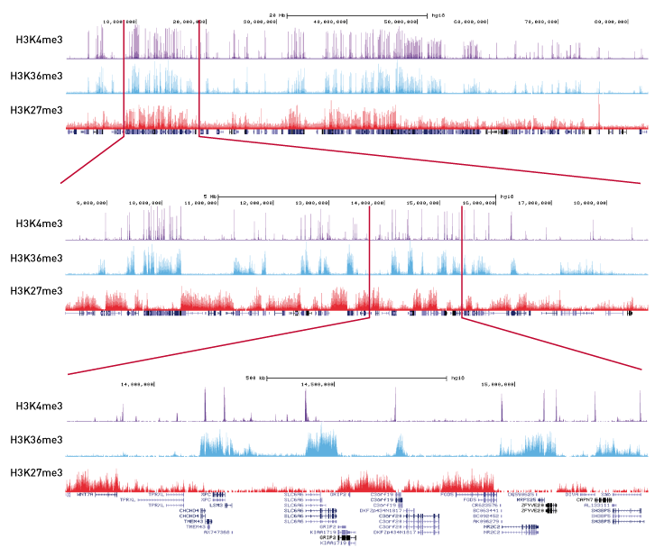

Sparsh Shah

A12764657

# ChIP-Seq

## ChIP-Seq - Identify Protein Interactions

The genome is very long and complex. Only a small fraction of the genome is actually functional. We need a method for determining the important, functional components from the non-functional segments. The regions that are important usually have proteins that interact with the DNA. This could be Transcription Factors binding to promote or supress a nearby gene or Histones raveling or unraveling the chromosome. To study this, we use the the powerful tools: ChIP-Seq. We will go through the steps of ChIP-Seq to see how this assay method can help us determine where proteins interact with the genome:

**Steps:**
* Crosslink DNA and Protein
* Sonicate to Shear the DNA
* Add Protein Specific Antibodies
* Immunoprecipitate
* Reverse Crosslink
* Purify DNA
* Sequence and Map DNA Fragments

### Crosslink

The Figure illustrates the process of crosslinking. With formaldehyde, protein-DNA interaction is facilitated. So, any proteins that may have bound to the genome do so now more easily. This produces a genome with proteins attached where they would interact. We now need to a way to find the sequences of where these interactions have occured and where they are on the genome.

### Shear DNA

To seperate out the DNA into chunks we can sequence, we sonicate the DNA. As the Figure shows, this shears the DNA into manageable, sequenceable chunks. However, this keeps the protein attached to the DNA fragment it interacts with. Now, we need to find a way to isolate the DNA fragment the proteins are attached to, take off the proteins of the fragment, and sequence the fragment.

### Add Antibody

We then add am antibody with a magnetic bead similar to the one in the Figure. This antibody is specific to the protein. So, we can choose certain proteins to study such as those for certain types of transcription factors. We can now get specific with the type of protein we wish to study.

### Immunoprecipitate

We now perform the immunoprecipitate. This uses the magnetic bead from the antibody to isolate the DNA-protein-antibody complex from all other material in the solution including DNA not of interest. As the Figure shows, we have now isolated the DNA that interacts with the protein we are studying from other DNA fragments. Now, all that is needed is for us to seperate the DNA from the DNA-protein-antibody complex and we can study the DNA.

### Reverse Crosslink and Purify

We now reverse the crosslinks we had formed earlier between the DNA and proteins. This can be done with heat and can be facilitated with proteins. Now that we have seperated the DNA from the complex, we purify DNA from the proteins and antibodies. The figure illustrates this. We now have purified DNA fragments that interacts with a specific proteins.

### Sequence and Map

We have completed the ChIP-Seq assay portion. Now that we have the isolated DNA fragments that we know interact with a certain protein, we sequence them and map them to the genome. As shown in the Figure, we know which what part of the genome specific proteins highly interact with.
